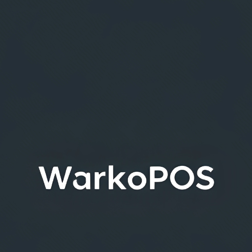

# WarkoPOS - Modern Point of Sale System

<div align="center">
  
  <h3>A Beautiful, Intuitive POS System for Modern Businesses</h3>
</div>

## ✨ Overview

WarkoPOS is a powerful, browser-based Point of Sale system designed for restaurants, cafes, and retail stores. Built with modern web technologies, it offers a responsive interface and rich features for managing products, processing orders, and tracking business performance.

### 🌟 Key Features

#### 💼 Product & Inventory Management
- **Smart Categories**
  - Color-coded categories
  - Multiple category selection
  - Real-time filtering
  - Category-specific views
  
- **Detailed Product Tracking**
  - Stock management
  - Low stock alerts
  - Product history
  - Image support
  - Internal notes

#### 🛒 Order Processing
- **Smart Cart System**
  - Real-time updates
  - Quick quantity adjustments
  - Automatic calculations
  - Tax management

- **Flexible Payments**
  - Multiple payment methods
  - Cash change calculation
  - Split payment support
  - Customizable tax rates

#### 🏷️ Receipt System
- **Professional Receipts**
  - Custom branding
  - Barcode generation
  - Detailed order info
  - Multiple copy support

#### 📊 Business Analytics
- **Real-time Insights**
  - Sales tracking
  - Revenue analytics
  - Order history
  - Stock monitoring

## 🚀 Quick Start

1. **Setup**
```bash
git clone https://github.com/warkopwarawiri/warkopos.git
cd warkopos
```

2. **Launch**
- Open `index.html` in a modern web browser
- Configure your store settings
- Start processing orders

## 📚 Documentation

- [User Guide](docs/user-guide.md) - Detailed usage instructions
- [Features](docs/features.md) - Complete feature list
- [Configuration](docs/configuration.md) - System settings
- [Contributing](CONTRIBUTING.md) - Development guide

## 🛠️ Technical Details

### Architecture
- **Frontend**: Pure HTML5, CSS3, JavaScript
- **Storage**: Browser LocalStorage
- **Dependencies**: Zero external dependencies
- **Compatibility**: All modern browsers

### Key Benefits
- 🔄 **Offline Capable**: Works without internet
- 📱 **Responsive**: Works on all devices
- 🚫 **Zero Dependencies**: No external libraries
- 🎨 **Customizable**: Easy to modify
- 🔒 **Secure**: Local data storage

## 💡 Use Cases

- **Restaurants & Cafes**
  - Table management
  - Order tracking
  - Kitchen receipts
  
- **Retail Stores**
  - Inventory tracking
  - Quick checkout
  - Customer management

- **Service Businesses**
  - Appointment tracking
  - Service billing
  - Customer history

## 🤝 Contributing

We welcome contributions! See our [Contributing Guide](CONTRIBUTING.md) for details.

## 📄 License

This project is licensed under the MIT License - see the [LICENSE](LICENSE) file for details.

## 🙏 Credits

- Icons by [Feather Icons](https://feathericons.com)
- Barcode generation by [BarcodeAPI.org](https://barcodeapi.org)

## 🆘 Support

- [Issue Tracker](https://github.com/warkopwarawiri/warkopos/issues)
- [Documentation](docs/)
- Email: me@ruriazz.com